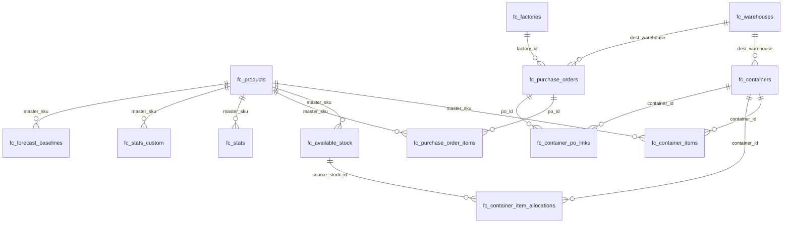
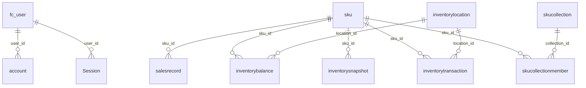

# Database ERD and Table Guide

> 대상 DB: `DATABASE_URL`의 PostgreSQL `shipcore` schema  
> 작성일: 2026-06-10  
> 기준: 실제 DB introspection + 현재 코드의 `shipcore.*` SQL/Prisma 사용처

이 문서는 현재 프로그램에서 운영 관리 대상으로 보는 주요 DB 테이블의 ERD와 테이블 설명서입니다. `shipcore` schema에는 운영 테이블, 레거시/동기화 보조 테이블, 뷰가 함께 있으므로 실제 화면에서 관리하지 않는 잔여 테이블은 제외했습니다.

- `fc_*`: 현재 Planning, Container, PO, SKU Forecast 중심 운영 테이블
- Prisma 기본 테이블: Products, legacy inventory, auth/session, integration 설정
- View: 집계/조회 편의를 위한 읽기 전용 객체

## 1. High-Level ERD

### 1-1. Planning / Container / Forecast Core

### 1-2. Auth / Prisma Legacy Domain

## 2. 테이블 그룹 요약

| 그룹 | 주요 테이블 | 프로그램 사용처 |
|---|---|---|
| Planning SKU Master | `fc_products`, `fc_stats`, `fc_stats_custom`, `fc_forecast_baselines` | SKU Master, Demand Planning, SKU Forecasts |
| Container Planning | `fc_containers`, `fc_container_items`, `fc_available_stock`, `fc_container_item_allocations` | Container Planning, Available Stock, SKU Forecast inbound |
| Purchase Orders | `fc_purchase_orders`, `fc_purchase_order_items`, `fc_container_po_links`, `fc_factories`, `fc_warehouses` | Purchase Orders, Factories, Warehouses |
| Velocity / Forecast Input | `fc_velocity_link_snapshot`, `fc_velocity_custom_snapshot`, `fc_replacement_parts` | Velocity page, stats refresh, SKU forecasts |
| Auth / Preferences | `fc_user`, `account`, `Session`, `verificationtoken`, `fc_user_preferences` | 로그인, 사용자 관리, 메뉴 권한, 사용자 설정 |
| Legacy Prisma App | `sku`, `salesrecord`, `inventorybalance`, `inventorylocation`, `purchaseorder`, `container` 등 | 구 Products/Inventory/PO 모델 또는 호환 레이어 |

## 3. FC Planning Tables

### `shipcore.fc_products` - Forecast/Planning 상품 마스터

Planning 모듈의 기준 SKU 테이블입니다. Container item, PO item, available stock, stats가 모두 `master_sku`로 이 테이블을 참조합니다.

| 항목 | 설명 |
|---|---|
| Primary Key | 보통 `id` 또는 `master_sku` 고유 제약. 코드에서는 `master_sku`를 사실상 자연키로 사용 |
| 주요 컬럼 | `master_sku`, `product_name`, `category`, `category_code`, `status`, `moq`, `order_multiple`, `cbm_per_unit`, `case_qty`, `weight_kg`, `is_custom_sku` |
| 관계 | `fc_container_items.master_sku`, `fc_purchase_order_items.master_sku`, `fc_available_stock.master_sku`, `fc_stats.master_sku`, `fc_stats_custom.master_sku` |
| 사용처 | `/planning/sku-master`, `/planning/dashboard`, `/planning/sku-forecasts`, `/planning/container-planning` |

### `shipcore.fc_stats` - Link 기준 Planning 통계 캐시

SC 중심 link velocity와 재고 데이터를 계산해 저장하는 통계 테이블입니다. Demand Planning API가 매번 원천 주문을 다시 집계하지 않도록 만든 캐시입니다.

| 주요 컬럼 | 설명 |
|---|---|
| `master_sku` | SKU 기준 키 |
| `west_stock`, `east_stock`, `back` | 현재 재고/백오더 관련 값 |
| `west_available_stock`, `east_available_stock`, `transit_stock`, `stock_mode` | 가용 재고/운송 재고/재고 계산 모드 |
| `west_90d`, `west_60d`, `west_30d`, `west_15d`, `west_7d` | West 판매 윈도우 집계 |
| `east_90d`, `east_60d`, `east_30d`, `east_15d`, `east_7d` | East 판매 윈도우 집계 |
| `avg_daily_*`, `east_avg_*`, `fba_avg_*`, `total_avg_*` | 평균 판매량 및 총 평균 |
| `calculated_at`, `updated_at` | 통계 계산/갱신 시각 |

### `shipcore.fc_stats_custom` - Custom SKU 기준 Planning 통계 캐시

`fc_stats`와 같은 구조지만 custom velocity snapshot을 기준으로 계산합니다. CC/FM 카테고리와 custom 모드에서 주로 사용합니다.

### `shipcore.fc_velocity_link_snapshot` - Link master SKU 판매 스냅샷

Velocity sync가 주문 데이터를 일자/채널/주문유형/link SKU로 집계한 원천 테이블입니다.

| 주요 컬럼 | 설명 |
|---|---|
| `order_date`, `order_date_la` | 주문일, LA 기준 주문일 |
| `item_category` | `Car Cover`, `Seat Cover`, `Floor Mat` 등 |
| `channel` | 판매 채널. 예: `Amazon FBA` |
| `order_type` | `sales`, `preorder`, `ttm`, `ttm_preorder` 등 |
| `link_master_sku`, `link_qty` | link 기준 master SKU와 수량 |
| `synced_at` | 동기화 시각 |

### `shipcore.fc_velocity_custom_snapshot` - Custom master SKU 판매 스냅샷

`fc_velocity_link_snapshot`과 같은 목적이지만 custom master SKU 기준입니다. 주요 컬럼은 `custom_master_sku`, `custom_qty`입니다.

### `shipcore.fc_forecast_baselines` - Forecast baseline

SKU별 기준 forecast 값을 저장하는 테이블입니다. `fc_forecast_dashboard` 뷰에서 최신 baseline을 가져올 때 사용합니다.

| 주요 컬럼 | 설명 |
|---|---|
| `master_sku` | `fc_products.master_sku` FK |
| `forecast_date` | baseline 기준 날짜 |
| `adjusted_daily_forecast` | 보정된 일평균 forecast |
| `seasonality_factor` | 시즌 계수 |

## 4. Container / Inbound Tables

### `shipcore.fc_containers` - Inbound container header

컨테이너 계획의 헤더 테이블입니다. 컨테이너 번호, ETA, 상태, CBM capacity, 공장/목적지 정보를 저장합니다.

| 주요 컬럼 | 설명 |
|---|---|
| `id` | 컨테이너 PK |
| `container_number` | 컨테이너 번호 |
| `eta_date` | 입고 예정일 |
| `actual_arrival_date` | 실제 도착일 |
| `status` | `draft`, `shipped`, `packing_received`, `complete` 등 DB 상태 |
| `cbm_capacity` | 컨테이너 CBM 한도 |
| `factory_name`, `origin`, `dest_warehouse`, `note` | 공장/출발지/목적 창고/비고 |

관계:

- `fc_container_items.container_id`
- `fc_container_item_allocations.container_id`
- `fc_container_po_links.container_id`
- `dest_warehouse -> fc_warehouses.warehouse_code`

### `shipcore.fc_container_items` - Container SKU line

컨테이너별 SKU 수량 라인입니다. Container Planning, Demand Planning inbound, SKU Forecast inbound의 핵심 라인 테이블입니다.

| 주요 컬럼 | 설명 |
|---|---|
| `id` | item PK |
| `container_id` | `fc_containers.id` FK |
| `master_sku` | `fc_products.master_sku` FK |
| `qty` | 컨테이너에 실린 수량 |
| `cbm_unit` | SKU 1개당 CBM |
| `total_cbm` | 라인 총 CBM |
| `created_at`, `updated_at` | 생성/수정 시각 |

### `shipcore.fc_available_stock` - Remaining/Mistake stock

컨테이너 외부에서 별도 배정 가능한 재고 소스입니다. Remaining stock, mistake stock 등을 관리합니다.

| 주요 컬럼 | 설명 |
|---|---|
| `id` | stock source PK |
| `source_type` | `remaining` 또는 `mistake` |
| `reference_no` | 출처 번호 |
| `master_sku` | `fc_products.master_sku` FK |
| `total_qty` | 총 수량 |
| `cbm_unit` | 단위 CBM |
| `note` | 비고 |

### `shipcore.fc_container_item_allocations` - Available stock allocation

`fc_available_stock`의 수량을 특정 컨테이너에 배정한 내역입니다.

| 주요 컬럼 | 설명 |
|---|---|
| `id` | allocation PK |
| `container_id` | `fc_containers.id` FK |
| `source_stock_id` | `fc_available_stock.id` FK |
| `qty` | 배정 수량 |
| `created_at`, `updated_at` | 생성/수정 시각 |

### `shipcore.fc_container_po_links` - Container / PO 연결

컨테이너와 구매주문을 연결하는 조인 테이블입니다.

| 주요 컬럼 | 설명 |
|---|---|
| `container_id` | `fc_containers.id` FK |
| `po_id` | `fc_purchase_orders.id` FK |

## 5. Purchase Order / Factory / Warehouse Tables

### `shipcore.fc_purchase_orders` - Forecast purchase order header

구매주문 헤더입니다. supplier/factory, destination warehouse, 상태, ETA 정보를 관리합니다.

| 주요 컬럼 | 설명 |
|---|---|
| `id` | PO PK |
| `po_number` | PO 번호 |
| `status` | PO 상태 |
| `factory_id` | `fc_factories.id` FK |
| `factory_name` | 공장명 denormalized 값 |
| `dest_warehouse` | `fc_warehouses.warehouse_code` FK |
| `order_date`, `expected_date`, `actual_date` | 주문/예상/실제 일자 |
| `notes` | 비고 |

### `shipcore.fc_purchase_order_items` - Forecast purchase order line

PO별 SKU 라인입니다.

| 주요 컬럼 | 설명 |
|---|---|
| `po_id` | `fc_purchase_orders.id` FK |
| `master_sku` | `fc_products.master_sku` FK |
| `qty` | 주문 수량 |
| `unit_cost`, `total_cost` | 단가/총액 |

### `shipcore.fc_factories` - Factory master

Planning에서 사용하는 공장 마스터입니다.

| 주요 컬럼 | 설명 |
|---|---|
| `id` | factory PK |
| `factory_code` | 공장 코드. `FC-0001` 형식 자동 생성 |
| `factory_name` | 공장명 |
| `origin` | 출발지 |
| `contact_name`, `email`, `phone` | 연락처 |
| `is_active` | 활성 여부 |

### `shipcore.fc_warehouses` - Warehouse master

Forecast/Container/PO에서 쓰는 창고 마스터입니다.

| 주요 컬럼 | 설명 |
|---|---|
| `id` | warehouse PK |
| `warehouse_code` | 창고 코드. 다른 테이블에서 FK로 사용 |
| `warehouse_name` | 창고명 |
| `warehouse_type` | 창고 타입 |
| `country`, `state_region`, `city`, `timezone` | 위치/시간대 |
| `is_active` | 활성 여부 |

## 6. Seat Cover / Replacement Parts Tables

### `shipcore.fc_replacement_parts` - Seat cover replacement part orders

Seat Cover Parts 화면에서 사용하는 교체 부품 주문 테이블입니다.

| 주요 컬럼 | 설명 |
|---|---|
| `id` | PK |
| `request_received_at` | 요청 접수일 |
| `order_number` | 주문 번호 |
| `part_number` | 부품 번호 |
| `corresponding_sku` | 연결 SKU |
| `qty` | 수량 |
| `orderstatus`, `shipping_status` | 주문/배송 상태 |
| `shiphero_order`, `shiphero_order_id` | ShipHero 주문 연결 |
| `delete_yn` | 삭제 플래그 |

### `shipcore.fc_seat_covers_indv_part_skus`

Seat cover 개별 부품 SKU lookup/import에 사용되는 보조 테이블입니다.

## 7. Auth / User Tables

### `shipcore.fc_user`

NextAuth 사용자 테이블입니다.

| 주요 컬럼 | 설명 |
|---|---|
| `id` | user PK |
| `name`, `email`, `image` | 사용자 프로필 |
| `email_verified` | 이메일 인증 시각 |
| `role` | `user`, `admin`, `dev`, `planner` 등 권한 |
| `password_hash` | credentials 로그인용 비밀번호 해시 |
| `menu_visibility` | 사용자별 메뉴 표시 설정 JSON |

### `shipcore.account`, `shipcore.Session`, `shipcore.verificationtoken`

NextAuth가 사용하는 계정/세션/토큰 테이블입니다.

| 테이블 | 설명 |
|---|---|
| `account` | OAuth provider 계정 연결 |
| `Session` | 로그인 세션 |
| `verificationtoken` | 이메일/인증 토큰 |

### `shipcore.fc_user_preferences`

사용자별 UI/기능 설정 저장소입니다.

| 주요 컬럼 | 설명 |
|---|---|
| `user_id` | 사용자 ID |
| `key` | preference key |
| `value` | JSON value |
| `updated_at` | 갱신 시각 |

## 8. Legacy Prisma Tables

아래 테이블은 Prisma schema에 남아 있고 일부 페이지 또는 호환 코드에서 사용됩니다. 신규 Planning 핵심 흐름은 대부분 `fc_*` 테이블을 사용합니다.

| 테이블 | 설명 |
|---|---|
| `sku` | legacy SKU master. Shopify/web SKU 중심 |
| `salesrecord` | legacy 판매 기록 |
| `inventorylocation` | legacy inventory location |
| `inventorybalance` | legacy SKU x location 재고 잔량 |
| `inventorysnapshot` | legacy SKU inventory snapshot |
| `inventorytransaction` | legacy inventory movement |
| `skucollection`, `skucollectionmember` | SKU collection 기능 |
| `trenddata`, `trendweightconfig` | trend/AI signal 저장 |
| `purchaseorder`, `poitem`, `container` | 초기 Prisma PO/container 모델 |

## 9. Views

| View | 설명 |
|---|---|
| `fc_forecast_dashboard` | `fc_products`, stock/inbound/baseline을 합친 forecast dashboard view |
| `fc_inbound_qty` | SKU별 inbound qty 집계 view |
| `fc_stock_total` | SKU별 stock/backorder 집계 view |
| `fc_latest_inventory` | 최신 inventory snapshot 조회 view |
| `v_sales_summary_report` | sales summary report view |

## 10. Program Endpoint to Table Map

| 화면/API | 주요 테이블 |
|---|---|
| `/planning/dashboard`, `/api/planning/dashboard` | `fc_products`, `fc_stats`, `fc_stats_custom`, `fc_containers`, `fc_container_items`, `fc_available_stock`, `fc_container_item_allocations`, `fc_velocity_*_snapshot` |
| `/planning/sku-forecasts` | `fc_products`, `fc_stats`, `fc_stats_custom`, `fc_container_items`, `fc_containers`, `fc_velocity_*_snapshot` |
| `/planning/container-planning`, `/api/containers` | `fc_containers`, `fc_container_items`, `fc_products`, `fc_available_stock`, `fc_container_item_allocations`, `fc_warehouses` |
| `/planning/purchase-orders`, `/api/purchase-orders` | `fc_purchase_orders`, `fc_purchase_order_items`, `fc_products`, `fc_factories`, `fc_warehouses`, `fc_container_po_links` |
| `/planning/available-stock`, `/api/container-available-stock` | `fc_available_stock`, `fc_container_item_allocations`, `fc_products`, `fc_containers` |
| `/planning/sku-master`, `/api/planning/sku-master` | `fc_products`, `fc_forecast_dashboard`, `fc_forecast_baselines` |
| `/velocity`, `/api/velocity/*` | `fc_velocity_link_snapshot`, `fc_velocity_custom_snapshot` |
| `/settings/users`, `/api/admin/users` | `fc_user`, `account`, `Session`, `fc_user_preferences` |

## 11. Excluded Tables

아래 테이블은 실제 DB에 존재하거나 일부 오래된 코드/문서에 언급되지만, 이 문서의 ERD와 상세 설명에서는 제외했습니다.

| 제외 대상 | 제외 이유 |
|---|---|
| `sc_*` 테이블 | 외부 동기화/레거시 계열로, 현재 Planning 운영 ERD의 핵심 관리 대상에서 제외 |
| `fc_planning_*` 테이블 | 초기 planning prototype/seed SQL 계열. 현재 주요 dashboard API는 `fc_products`, `fc_stats`, `fc_containers`, `fc_container_items`를 직접 조회 |
| rename 이전 이름 | `sc_user`, `sc_platform_integration`, `velocity_*_snapshot` 등은 현재 `fc_user`, `fc_platform_integration`, `fc_velocity_*_snapshot`으로 대체 |

## 12. Notes and Caveats

- `fc_*` 중심 테이블을 현재 Planning 운영 테이블로 봅니다.
- 코드에는 rename 이전 이름인 `sc_user`, `sc_platform_integration`, `velocity_*_snapshot` 언급이 일부 문서/마이그레이션에 남아 있습니다. 실제 현재 테이블은 각각 `fc_user`, `fc_platform_integration`, `fc_velocity_*_snapshot`입니다.
- `fc_planning_*` 테이블은 초기 planning prototype/seed SQL 계열입니다. 현재 주요 dashboard API는 `fc_products`, `fc_stats`, `fc_containers`, `fc_container_items`를 직접 조회합니다.
- FK가 없는 컬럼도 애플리케이션에서 논리적으로 연결됩니다. 예: 일부 SKU 문자열 컬럼은 master SKU로 join하지만 DB FK가 없을 수 있습니다.
